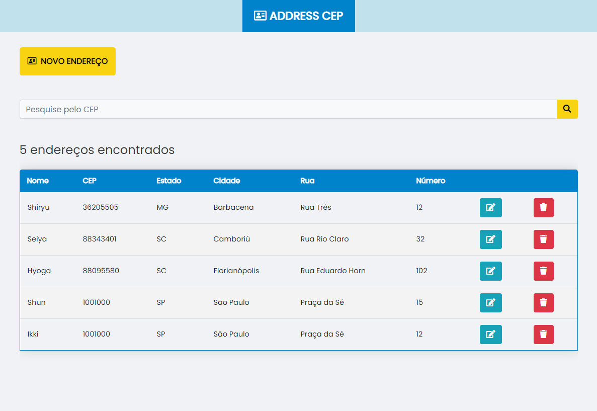

<!-- PROJECT LOGO -->
<p align="center">
  <a href="https://github.com/othneildrew/Best-README-Template">
    
  </a>

  <h3 align="center">search-cep</h3>

  <p align="center">
    <a href="https://almeida-matheus.github.io/search-cep/demo/index.html">
        
    </a>
  </p>
</p>

<!-- TABLE OF CONTENTS -->
<details open="open">
  <summary>Table of Contents</summary>
  <br>
  <ol>
    <li><a href="#about-the-project">About The Project</a></li>
    <li><a href="#installation">Installation</a></li>
    <li><a href="#contributing">Contributing</a></li>
  </ol>
</details>

<!-- ABOUT THE PROJECT -->
## About The Project



> Web application that searches zip code and register the address.
#### Built With

* HTML
* CSS
* Javascript
* PHP
* MySQL

<!-- INSTALATION -->
## Installation
#### 1. Install PHP and MySQL
```
sudo apt-get install php default-mysql-server php-mysql apache2 libapache2-mod-php phpmyadmin -y
```

#### 2. Clone git repository
```
git clone "https://github.com/almeida-matheus/search-cep"
```

#### 3. Load sample data into MySQL
```
# open mysql bash
mysql -u <mysql-user> -p

# Give the absolute path of the file
mysql> source ~/search-cep/project/database_structure.sql
mysql> exit;
```
#### 4. Edit project settings
```
# open settings file
vim search-cep/project/config.php

# Edit Database configurations with your MySQL configurations.
$mysql = new mysqli('localhost', 'root', '', 'db_address');

# save the file
```

<!-- CONTRIBUTING -->
## Contributing
1. Fork the Project
2. Clone this project (`https://github.com/almeida-matheus/search-cep`)
3. Create your Feature Branch (`git checkout -b nameBranch`)
4. Add your Changes (`git add .`)
5. Commit your Changes (`git commit -m 'Add some feature'`)
6. Push to the Branch (`git push origin nameBranch`)
7. Open a Pull Request
